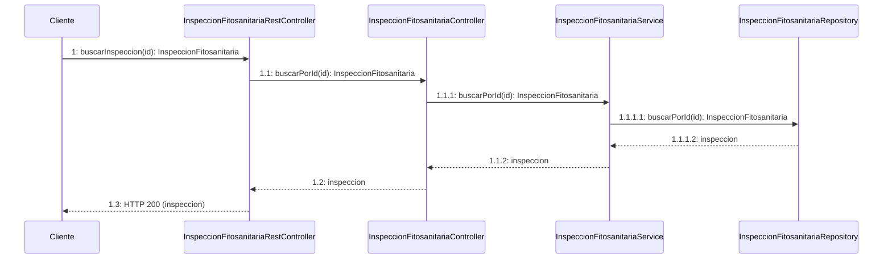
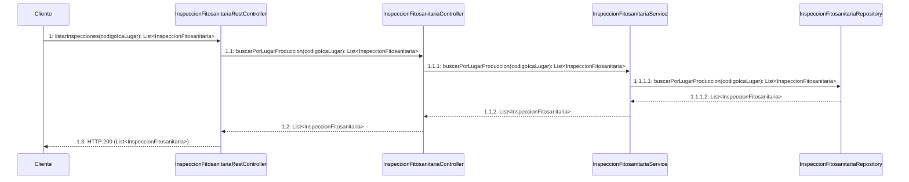
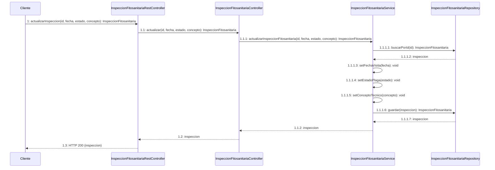
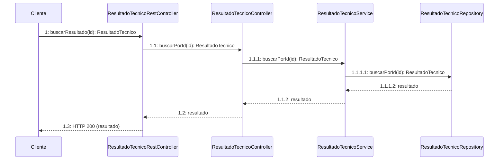
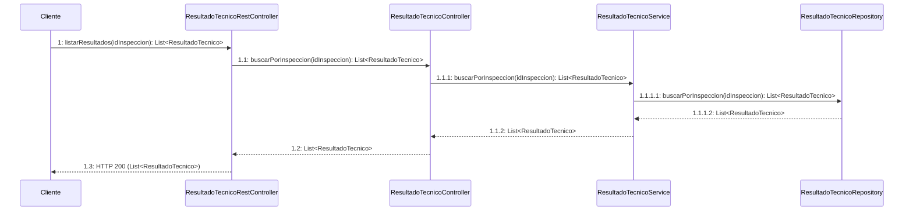
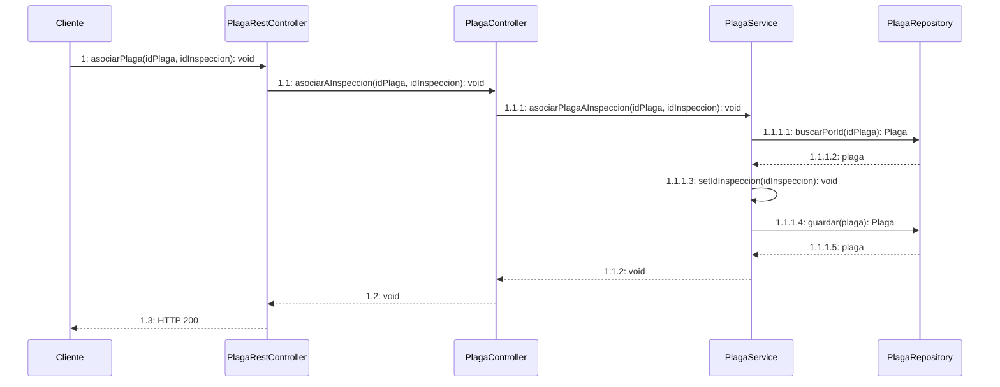
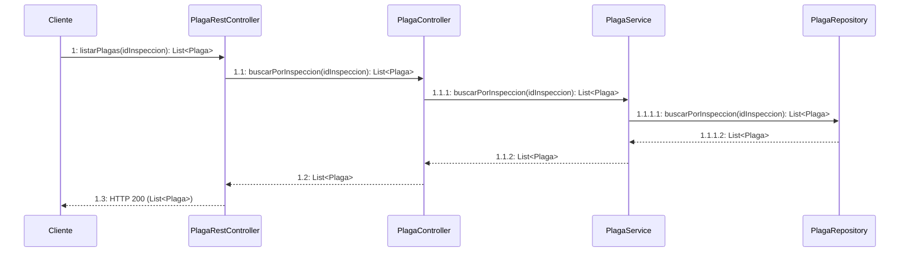

# 📐 DIAGRAMAS DE SECUENCIA - MS-INSPECCIONES

**Microservicio:** MS-INSPECCIONES  
**Puerto:** 8083  
**Base URL:** http://localhost:8083  
**Estilo:** Académico UML

---

## 📋 ÍNDICE

1. **Inspección Fitosanitaria**
   - [1. Crear Inspección (con validación inter-microservicio)](#1️⃣-sd-crear-inspeccion-fitosanitaria---comunicacion-entre-microservicios)
   - [2. Buscar Inspección por ID](#2️⃣-sd-buscar-inspeccion-por-id)
   - [3. Listar Inspecciones por Lugar](#3️⃣-sd-listar-inspecciones-por-lugar)
   - [4. Actualizar Inspección](#4️⃣-sd-actualizar-inspeccion-fitosanitaria)

2. **Resultado Técnico**
   - [5. Registrar Resultado Técnico](#5️⃣-sd-registrar-resultado-tecnico)
   - [6. Buscar Resultado por ID](#6️⃣-sd-buscar-resultado-por-id)
   - [7. Listar Resultados de una Inspección](#7️⃣-sd-listar-resultados-de-una-inspeccion)

3. **Plaga**
   - [8. Registrar Plaga](#8️⃣-sd-registrar-plaga)
   - [9. Asociar Plaga a Inspección](#9️⃣-sd-asociar-plaga-a-inspeccion)
   - [10. Listar Plagas de una Inspección](#🔟-sd-listar-plagas-de-una-inspeccion)

---

# 🔬 DIAGRAMAS DE SECUENCIA - INSPECCIÓN FITOSANITARIA

---

## 1️⃣ sd Crear Inspeccion Fitosanitaria - Comunicacion entre Microservicios

> **⚠️ IMPORTANTE:** Este diagrama muestra la comunicación entre MS-INSPECCIONES (8083) y MS-TERRITORIAL (8082) usando RestTemplate.

```mermaid
sequenceDiagram
    participant Cliente
    participant REST as InspeccionFitosanitariaRestController
    participant RestTemplate
    participant MS_TERRITORIAL as MS-TERRITORIAL:8082
    participant Controller as InspeccionFitosanitariaController
    participant Service as InspeccionFitosanitariaService
    participant Repository as InspeccionFitosanitariaRepository
    participant :InspeccionFitosanitaria

    Cliente->>REST: 1: crearInspeccion(fecha, estado, concepto, codigoIcaLugar, idAsistente): InspeccionFitosanitaria
    REST->>RestTemplate: 1.1: getForObject(urlLugarProduccion, Object.class): Object
    RestTemplate->>MS_TERRITORIAL: 1.1.1: GET /api/lugares-produccion/{codigoIcaLugar}
    MS_TERRITORIAL-->>RestTemplate: 1.1.2: HTTP 200 (LugarProduccion)
    RestTemplate-->>REST: 1.2: LugarProduccion
    REST->>Controller: 1.3: crear(fecha, estado, concepto, codigoIcaLugar, idAsistente): InspeccionFitosanitaria
    Controller->>Service: 1.3.1: crearInspeccionFitosanitaria(...): InspeccionFitosanitaria
    Service->>:InspeccionFitosanitaria: 1.3.1.1: <<create>>
    Service->>Repository: 1.3.1.2: guardar(inspeccion): InspeccionFitosanitaria
    Repository-->>Service: 1.3.1.3: inspeccion
    Service-->>Controller: 1.3.2: inspeccion
    Controller-->>REST: 1.4: inspeccion
    REST-->>Cliente: 1.5: HTTP 201 (inspeccion)
```

**Flujo de validación:**
1. Cliente envía petición a MS-INSPECCIONES
2. MS-INSPECCIONES usa RestTemplate para validar que el lugar de producción existe en MS-TERRITORIAL
3. Si existe, procede a crear la inspección
4. Si no existe, retorna HTTP 400 Bad Request

---

## 2️⃣ sd Buscar Inspeccion por ID



---

## 3️⃣ sd Listar Inspecciones por Lugar



---

## 4️⃣ sd Actualizar Inspeccion Fitosanitaria



---

# 📊 DIAGRAMAS DE SECUENCIA - RESULTADO TÉCNICO

---

## 5️⃣ sd Registrar Resultado Tecnico

```mermaid
sequenceDiagram
    participant Cliente
    participant REST as ResultadoTecnicoRestController
    participant Controller as ResultadoTecnicoController
    participant Service as ResultadoTecnicoService
    participant Repository as ResultadoTecnicoRepository
    participant :ResultadoTecnico

    Cliente->>REST: 1: registrarResultado(tipo, valorObservado, unidadMedida, idInspeccion): ResultadoTecnico
    REST->>Controller: 1.1: crear(tipo, valorObservado, unidadMedida, idInspeccion): ResultadoTecnico
    Controller->>Service: 1.1.1: crearResultadoTecnico(...): ResultadoTecnico
    Service->>:ResultadoTecnico: 1.1.1.1: <<create>>
    Service->>Repository: 1.1.1.2: guardar(resultado): ResultadoTecnico
    Repository-->>Service: 1.1.1.3: resultado
    Service-->>Controller: 1.1.2: resultado
    Controller-->>REST: 1.2: resultado
    REST-->>Cliente: 1.3: HTTP 201 (resultado)
```

---

## 6️⃣ sd Buscar Resultado por ID



---

## 7️⃣ sd Listar Resultados de una Inspeccion



---

# 🐛 DIAGRAMAS DE SECUENCIA - PLAGA

---

## 8️⃣ sd Registrar Plaga

```mermaid
sequenceDiagram
    participant Cliente
    participant REST as PlagaRestController
    participant Controller as PlagaController
    participant Service as PlagaService
    participant Repository as PlagaRepository
    participant :Plaga

    Cliente->>REST: 1: registrarPlaga(nombreComun, nombreCientifico, tipoPlaga): Plaga
    REST->>Controller: 1.1: crear(nombreComun, nombreCientifico, tipoPlaga): Plaga
    Controller->>Service: 1.1.1: crearPlaga(nombreComun, nombreCientifico, tipoPlaga): Plaga
    Service->>:Plaga: 1.1.1.1: <<create>>
    Service->>Repository: 1.1.1.2: guardar(plaga): Plaga
    Repository-->>Service: 1.1.1.3: plaga
    Service-->>Controller: 1.1.2: plaga
    Controller-->>REST: 1.2: plaga
    REST-->>Cliente: 1.3: HTTP 201 (plaga)
```

---

## 9️⃣ sd Asociar Plaga a Inspeccion



---

## 🔟 sd Listar Plagas de una Inspeccion



---

## 🌐 Arquitectura de Microservicios

```
┌─────────────────────────────────────┐      ┌─────────────────────────────────────┐
│     MS-INSPECCIONES (8083)          │      │     MS-TERRITORIAL (8082)           │
│                                     │      │                                     │
│  InspeccionFitosanitariaController  │      │  LugarProduccionController          │
│              ↓                      │      │              ↓                      │
│  InspeccionFitosanitariaService     │      │  LugarProduccionService             │
│              ↓                      │      │              ↓                      │
│  InspeccionFitosanitariaRepository  │      │  LugarProduccionRepository          │
└─────────────────────────────────────┘      └─────────────────────────────────────┘
              ↑
              │
        RestTemplate
     (HTTP GET Request)
              │
              └──────> GET /api/lugares-produccion/{codigoIca}
```

**Comunicación entre microservicios:**
- MS-INSPECCIONES valida existencia de LugarProducción en MS-TERRITORIAL
- Usa RestTemplate configurado como @Bean en UsuariosApplication
- Si el lugar no existe, retorna HTTP 400 Bad Request
- Si existe, procede con la creación de la inspección

---

## 🏗️ Arquitectura de Capas

```
┌─────────────────────────────────────────────────┐
│  CAPA REST (Controllers REST)                   │
│  - Endpoints HTTP                               │
│  - Validación de entrada                        │
│  - Comunicación inter-microservicio             │
└─────────────────────────────────────────────────┘
                    ↓
┌─────────────────────────────────────────────────┐
│  CAPA PRESENTACIÓN (Controllers)                │
│  - Lógica de coordinación                       │
│  - Transformación de datos                      │
└─────────────────────────────────────────────────┘
                    ↓
┌─────────────────────────────────────────────────┐
│  CAPA NEGOCIO (Services)                        │
│  - Reglas de negocio                            │
│  - Validaciones                                 │
│  - Lógica de dominio                            │
└─────────────────────────────────────────────────┘
                    ↓
┌─────────────────────────────────────────────────┐
│  CAPA PERSISTENCIA (Repositories)               │
│  - Acceso a datos                               │
│  - CRUD básico                                  │
└─────────────────────────────────────────────────┘
```

---

## 🔗 URLs del MS-INSPECCIONES

Base URL: `http://localhost:8083`

### Endpoints Inspecciones Fitosanitarias:
- `POST /api/inspecciones` - Crear inspección (valida con MS-TERRITORIAL)
- `GET /api/inspecciones` - Listar todas
- `GET /api/inspecciones?codigoIcaLugar={codigo}` - Filtrar por lugar
- `GET /api/inspecciones/{id}` - Buscar por ID
- `PUT /api/inspecciones/{id}` - Actualizar inspección
- `DELETE /api/inspecciones/{id}` - Eliminar inspección

### Endpoints Resultados Técnicos:
- `POST /api/resultados-tecnicos` - Registrar resultado
- `GET /api/resultados-tecnicos` - Listar todos
- `GET /api/resultados-tecnicos?idInspeccion={id}` - Filtrar por inspección
- `GET /api/resultados-tecnicos/{id}` - Buscar por ID
- `DELETE /api/resultados-tecnicos/{id}` - Eliminar resultado

### Endpoints Plagas:
- `POST /api/plagas` - Registrar plaga
- `GET /api/plagas` - Listar todas
- `GET /api/plagas?idInspeccion={id}` - Filtrar por inspección
- `GET /api/plagas/{id}` - Buscar por ID
- `DELETE /api/plagas/{id}` - Eliminar plaga
