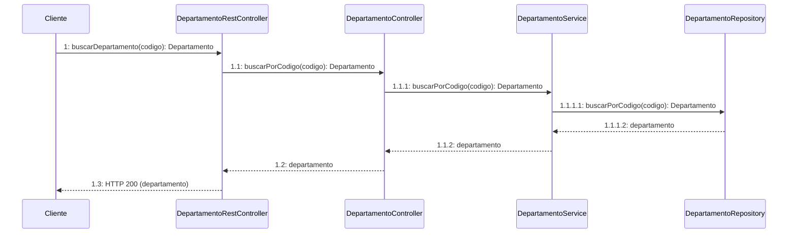
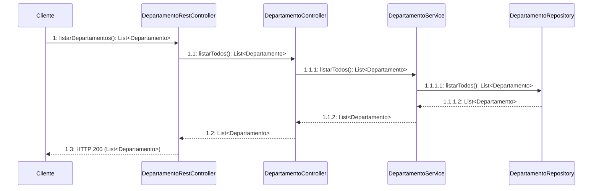
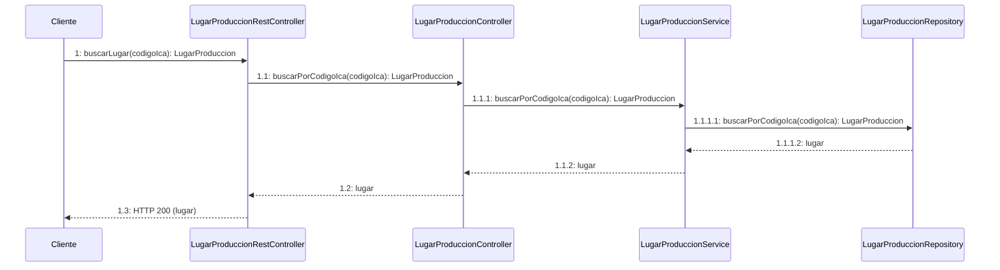
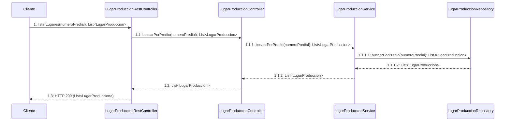
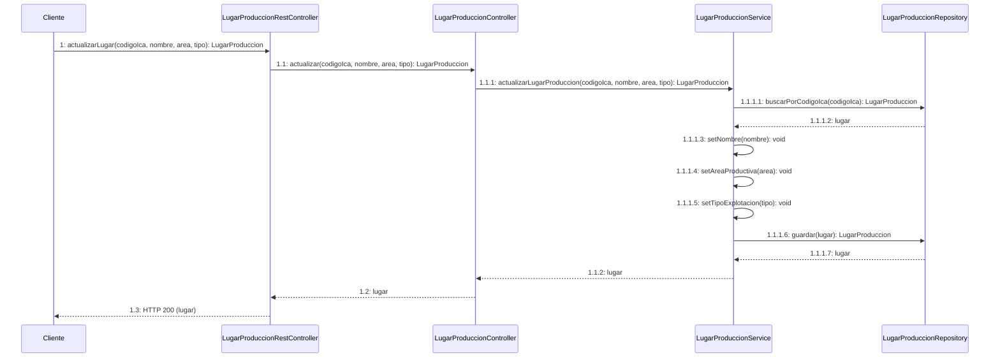
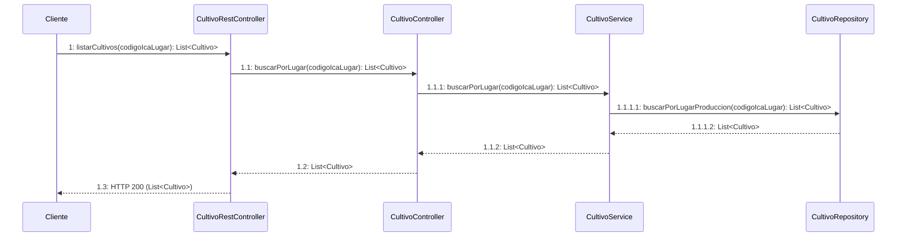

# 📐 DIAGRAMAS DE SECUENCIA - MS-TERRITORIAL

**Microservicio:** MS-TERRITORIAL  
**Puerto:** 8082  
**Base URL:** http://localhost:8082  
**Estilo:** Académico UML

---

## 📋 ÍNDICE

1. **Departamento**
   - [1. Crear Departamento](#1️⃣-sd-crear-departamento)
   - [2. Buscar Departamento por Código](#2️⃣-sd-buscar-departamento-por-codigo)
   - [3. Listar Todos los Departamentos](#3️⃣-sd-listar-todos-los-departamentos)

2. **Lugar de Producción**
   - [4. Crear Lugar de Producción](#4️⃣-sd-crear-lugar-de-produccion)
   - [5. Buscar Lugar por Código ICA](#5️⃣-sd-buscar-lugar-por-codigo-ica)
   - [6. Consultar Lugares por Predio](#6️⃣-sd-consultar-lugares-por-predio)
   - [7. Actualizar Lugar de Producción](#7️⃣-sd-actualizar-lugar-de-produccion)

3. **Cultivo**
   - [8. Crear Cultivo en Lugar](#8️⃣-sd-crear-cultivo-en-lugar)
   - [9. Listar Cultivos de un Lugar](#9️⃣-sd-listar-cultivos-de-un-lugar)

---

# 🏛️ DIAGRAMAS DE SECUENCIA - DEPARTAMENTO

---

## 1️⃣ sd Crear Departamento

```mermaid
sequenceDiagram
    participant Cliente
    participant REST as DepartamentoRestController
    participant Controller as DepartamentoController
    participant Service as DepartamentoService
    participant Repository as DepartamentoRepository
    participant :Departamento

    Cliente->>REST: 1: crearDepartamento(codigo, nombre): Departamento
    REST->>Controller: 1.1: crear(codigo, nombre): Departamento
    Controller->>Service: 1.1.1: crearDepartamento(codigo, nombre): Departamento
    Service->>Repository: 1.1.1.1: buscarPorCodigo(codigo): Departamento
    Repository-->>Service: 1.1.1.2: null
    Service->>:Departamento: 1.1.1.3: <<create>>
    Service->>Repository: 1.1.1.4: guardar(departamento): Departamento
    Repository-->>Service: 1.1.1.5: departamento
    Service-->>Controller: 1.1.2: departamento
    Controller-->>REST: 1.2: departamento
    REST-->>Cliente: 1.3: HTTP 201 (departamento)
```

---

## 2️⃣ sd Buscar Departamento por Codigo



---

## 3️⃣ sd Listar Todos los Departamentos



---

# 🌾 DIAGRAMAS DE SECUENCIA - LUGAR DE PRODUCCIÓN

---

## 4️⃣ sd Crear Lugar de Produccion

```mermaid
sequenceDiagram
    participant Cliente
    participant REST as LugarProduccionRestController
    participant Controller as LugarProduccionController
    participant Service as LugarProduccionService
    participant Repository as LugarProduccionRepository
    participant :LugarProduccion

    Cliente->>REST: 1: crearLugar(codigoIca, nombre, area, tipo, predio): LugarProduccion
    REST->>Controller: 1.1: crear(codigoIca, nombre, area, tipo, predio): LugarProduccion
    Controller->>Service: 1.1.1: crearLugarProduccion(codigoIca, nombre, area, tipo, predio): LugarProduccion
    Service->>Repository: 1.1.1.1: buscarPorCodigoIca(codigoIca): LugarProduccion
    Repository-->>Service: 1.1.1.2: null
    Service->>:LugarProduccion: 1.1.1.3: <<create>>
    Service->>Repository: 1.1.1.4: guardar(lugar): LugarProduccion
    Repository-->>Service: 1.1.1.5: lugar
    Service-->>Controller: 1.1.2: lugar
    Controller-->>REST: 1.2: lugar
    REST-->>Cliente: 1.3: HTTP 201 (lugar)
```

---

## 5️⃣ sd Buscar Lugar por Codigo ICA



---

## 6️⃣ sd Consultar Lugares por Predio



---

## 7️⃣ sd Actualizar Lugar de Produccion



---

# 🌱 DIAGRAMAS DE SECUENCIA - CULTIVO

---

## 8️⃣ sd Crear Cultivo en Lugar

```mermaid
sequenceDiagram
    participant Cliente
    participant REST as CultivoRestController
    participant Controller as CultivoController
    participant Service as CultivoService
    participant Repository as CultivoRepository
    participant :Cultivo

    Cliente->>REST: 1: crearCultivo(codigoIcaLugar, nombre, variedad, area): Cultivo
    REST->>Controller: 1.1: crear(codigoIcaLugar, nombre, variedad, area): Cultivo
    Controller->>Service: 1.1.1: crearCultivo(codigoIcaLugar, nombre, variedad, area): Cultivo
    Service->>:Cultivo: 1.1.1.1: <<create>>
    Service->>Repository: 1.1.1.2: guardar(cultivo): Cultivo
    Repository-->>Service: 1.1.1.3: cultivo
    Service-->>Controller: 1.1.2: cultivo
    Controller-->>REST: 1.2: cultivo
    REST-->>Cliente: 1.3: HTTP 201 (cultivo)
```

---

## 9️⃣ sd Listar Cultivos de un Lugar



---

## 🏗️ Arquitectura de Capas

```
┌─────────────────────────────────────────────────┐
│  CAPA REST (Controllers REST)                   │
│  - Endpoints HTTP                               │
│  - Validación de entrada                        │
│  - Manejo de respuestas HTTP                    │
└─────────────────────────────────────────────────┘
                    ↓
┌─────────────────────────────────────────────────┐
│  CAPA PRESENTACIÓN (Controllers)                │
│  - Lógica de coordinación                       │
│  - Transformación de datos                      │
└─────────────────────────────────────────────────┘
                    ↓
┌─────────────────────────────────────────────────┐
│  CAPA NEGOCIO (Services)                        │
│  - Reglas de negocio                            │
│  - Validaciones                                 │
│  - Lógica de dominio                            │
└─────────────────────────────────────────────────┘
                    ↓
┌─────────────────────────────────────────────────┐
│  CAPA PERSISTENCIA (Repositories)               │
│  - Acceso a datos                               │
│  - CRUD básico                                  │
└─────────────────────────────────────────────────┘
```

---

## 🔗 URLs del MS-TERRITORIAL

Base URL: `http://localhost:8082`

### Endpoints Departamentos:
- `POST /api/departamentos` - Crear departamento
- `GET /api/departamentos` - Listar todos
- `GET /api/departamentos/{codigo}` - Buscar por código

### Endpoints Lugares de Producción:
- `POST /api/lugares-produccion` - Crear lugar
- `GET /api/lugares-produccion` - Listar todos
- `GET /api/lugares-produccion?numeroPredial={num}` - Filtrar por predio
- `GET /api/lugares-produccion/{codigoIca}` - Buscar por código ICA
- `PUT /api/lugares-produccion/{codigoIca}` - Actualizar lugar
- `DELETE /api/lugares-produccion/{codigoIca}` - Eliminar lugar

### Endpoints Cultivos:
- `POST /api/cultivos` - Crear cultivo
- `GET /api/cultivos` - Listar todos
- `GET /api/cultivos?codigoIcaLugar={codigo}` - Filtrar por lugar
- `GET /api/cultivos/{id}` - Buscar por ID
- `DELETE /api/cultivos/{id}` - Eliminar cultivo
