# 📊 Diagramas de Secuencia - MS-USUARIOS

## 1️⃣ sd Crear Productor

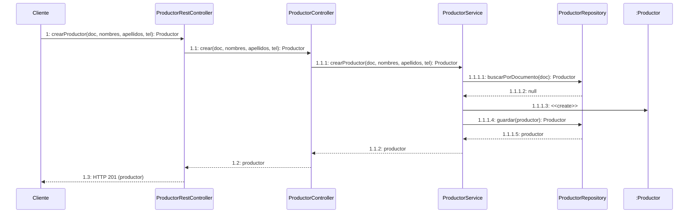

---

## 2️⃣ sd Buscar Productor por ID

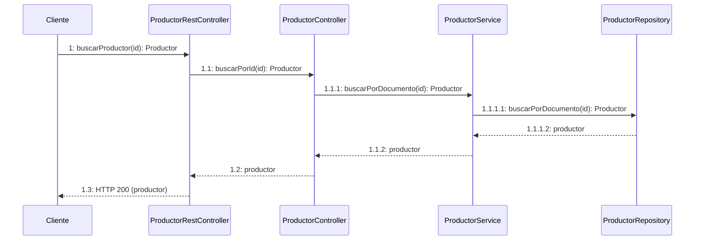

---

## 3️⃣ sd Listar Todos los Productores

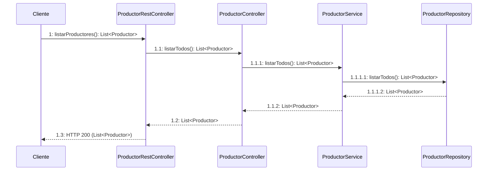

---

## 4️⃣ sd Actualizar Productor

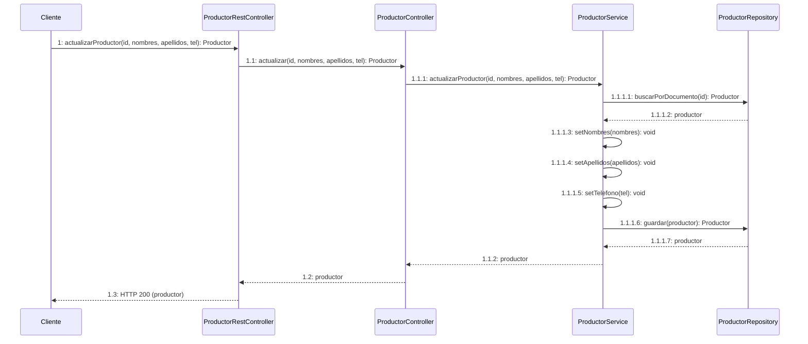

---

## 5️⃣ sd Eliminar Productor

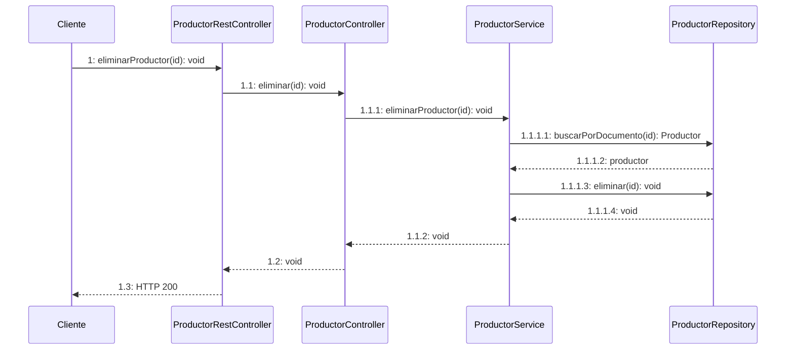

---

## 6️⃣ sd Consultar Todos los Usuarios

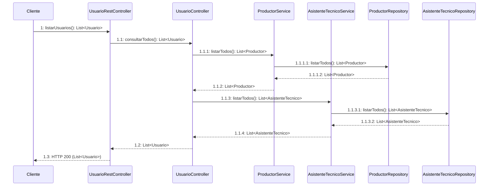

---

## 7️⃣ sd Crear Productor - Documento Duplicado

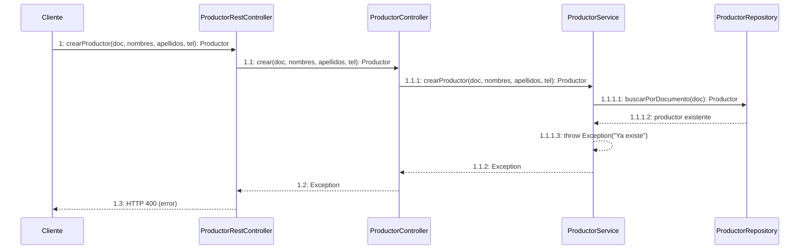

---

## 📋 Arquitectura de Capas

```
┌─────────────────────────────────────────────────┐
│  CAPA REST (Spring Boot Controllers)           │
│  - Manejo de HTTP (GET, POST, PUT, DELETE)     │
│  - Validación de entrada                        │
│  - Serialización JSON                           │
│  - Status codes HTTP                            │
└─────────────────────────────────────────────────┘
                    ↓
┌─────────────────────────────────────────────────┐
│  CAPA PRESENTACIÓN (Controllers)                │
│  - Coordinación de servicios                    │
│  - Validaciones básicas                         │
│  - Transformación de datos                      │
└─────────────────────────────────────────────────┘
                    ↓
┌─────────────────────────────────────────────────┐
│  CAPA NEGOCIO (Services)                        │
│  - Lógica de negocio                            │
│  - Validaciones de dominio                      │
│  - Reglas de negocio                            │
│  - Manejo de excepciones                        │
└─────────────────────────────────────────────────┘
                    ↓
┌─────────────────────────────────────────────────┐
│  CAPA PERSISTENCIA (Repositories)               │
│  - Acceso a datos                               │
│  - CRUD básico                                  │
│  - Consultas específicas                        │
└─────────────────────────────────────────────────┘
                    ↓
┌─────────────────────────────────────────────────┐
│  ALMACENAMIENTO (HashMap en memoria)            │
│  - Datos en memoria (puede ser BD)              │
└─────────────────────────────────────────────────┘
```

---

## 🔄 Flujo de Datos

### Petición (Request):
```
HTTP Request (JSON)
    ↓
REST Controller (@RequestBody deserializa JSON → Objeto)
    ↓
Presentación Controller (valida parámetros)
    ↓
Service (lógica de negocio, valida reglas)
    ↓
Repository (acceso a datos)
    ↓
Almacenamiento (guarda/consulta)
```

### Respuesta (Response):
```
Almacenamiento (retorna datos)
    ↓
Repository (retorna entidad)
    ↓
Service (procesa resultado)
    ↓
Presentación Controller (prepara respuesta)
    ↓
REST Controller (serializa Objeto → JSON, asigna status code)
    ↓
HTTP Response (JSON + Status Code)
```

---

## 📊 Tipos de Respuestas HTTP

| Status Code | Operación | Descripción |
|------------|-----------|-------------|
| **200 OK** | GET, PUT, DELETE | Operación exitosa |
| **201 Created** | POST | Recurso creado exitosamente |
| **400 Bad Request** | Cualquiera | Error en validación o datos inválidos |
| **404 Not Found** | GET, PUT, DELETE | Recurso no encontrado |
| **500 Internal Server Error** | Cualquiera | Error interno del servidor |

---

## 🎯 Componentes del MS-USUARIOS

### REST Controllers:
- `ProductorRestController` - Endpoints de productores
- `AsistenteTecnicoRestController` - Endpoints de asistentes técnicos
- `UsuarioRestController` - Endpoints generales de usuarios

### Controllers (Presentación):
- `ProductorController` - Lógica de coordinación productores
- `AsistenteTecnicoController` - Lógica de coordinación asistentes
- `UsuarioController` - Consultas combinadas

### Services (Negocio):
- `ProductorService` - Reglas de negocio productores
- `AsistenteTecnicoService` - Reglas de negocio asistentes
- `UsuarioService` - Lógica general usuarios

### Repositories (Persistencia):
- `ProductorRepository` - CRUD productores
- `AsistenteTecnicoRepository` - CRUD asistentes técnicos
- `UsuarioRepository` - Consultas generales

### Modelos:
- `Productor` - Entidad productor
- `AsistenteTecnico` - Entidad asistente técnico
- `Usuario` - Clase base abstracta

---

## 🔗 URLs del MS-USUARIOS

Base URL: `http://localhost:8081`

### Endpoints Productores:
- `POST /api/productores` - Crear
- `GET /api/productores` - Listar todos
- `GET /api/productores/{id}` - Buscar por ID
- `PUT /api/productores/{id}` - Actualizar
- `DELETE /api/productores/{id}` - Eliminar

### Endpoints Asistentes Técnicos:
- `POST /api/asistentes-tecnicos` - Crear
- `GET /api/asistentes-tecnicos` - Listar todos
- `GET /api/asistentes-tecnicos/{id}` - Buscar por ID
- `PUT /api/asistentes-tecnicos/{id}` - Actualizar
- `DELETE /api/asistentes-tecnicos/{id}` - Eliminar

### Endpoints Generales:
- `GET /api/usuarios` - Listar todos los usuarios

---

# 📋 DIAGRAMAS DE SECUENCIA - ASISTENTE TÉCNICO

---

## 8️⃣ sd Crear AsistenteTecnico

```mermaid
sequenceDiagram
    participant Cliente
    participant REST as AsistenteTecnicoRestController
    participant Controller as AsistenteTecnicoController
    participant Service as AsistenteTecnicoService
    participant Repository as AsistenteTecnicoRepository
    participant :AsistenteTecnico

    Cliente->>REST: 1: crearAsistente(doc, nombres, apellidos, tel, esp): AsistenteTecnico
    REST->>Controller: 1.1: crear(doc, nombres, apellidos, tel, esp): AsistenteTecnico
    Controller->>Service: 1.1.1: crearAsistenteTecnico(doc, nombres, apellidos, tel, esp): AsistenteTecnico
    Service->>Repository: 1.1.1.1: buscarPorDocumento(doc): AsistenteTecnico
    Repository-->>Service: 1.1.1.2: null
    Service->>:AsistenteTecnico: 1.1.1.3: <<create>>
    Service->>Repository: 1.1.1.4: guardar(asistente): AsistenteTecnico
    Repository-->>Service: 1.1.1.5: asistente
    Service-->>Controller: 1.1.2: asistente
    Controller-->>REST: 1.2: asistente
    REST-->>Cliente: 1.3: HTTP 201 (asistente)
```

---

## 9️⃣ sd Buscar AsistenteTecnico por ID

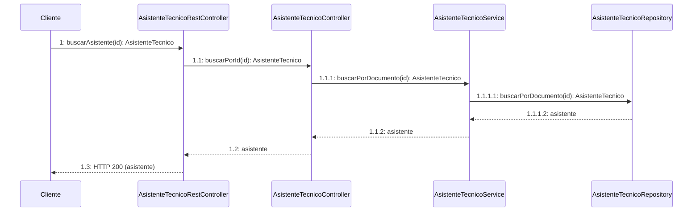

---

## 🔟 sd Listar Todos los AsistentesTecnicos

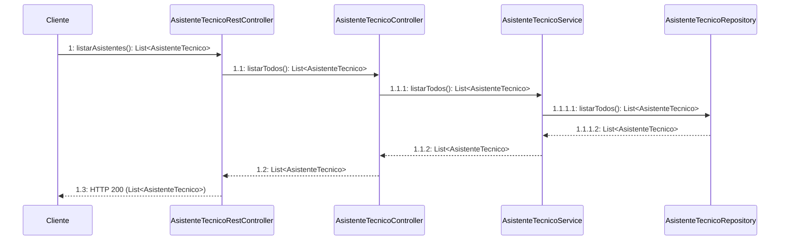

---

## 11. sd Actualizar AsistenteTecnico

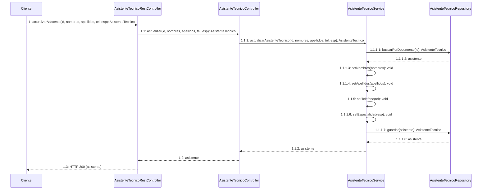

---

## 12. sd Eliminar AsistenteTecnico

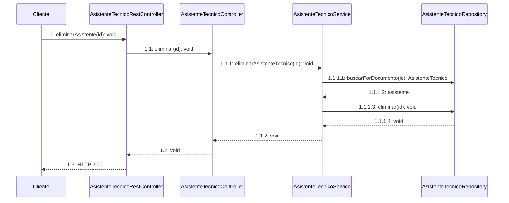
- `GET /api/usuarios/healthcheck` - Verificar estado del MS
